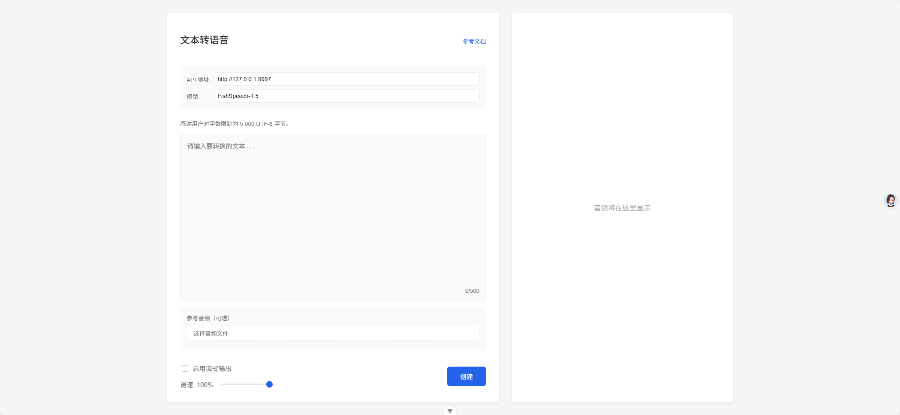

# 文本转语音工具

一个基于 Vue 3 + TypeScript 开发的文本转语音工具，支持参考音频上传和语音速度调节。



## 功能特性

- 🎯 文本转语音：支持输入文本并转换为语音
- 🎵 参考音频：支持上传参考音频文件，实现声音克隆
- 🎚️ 速度调节：可调节语音播放速度（0.5x - 1.5x）
- ⚙️ 配置灵活：支持自定义 API 端点和模型选择
- 🎨 现代化界面：响应式设计，支持深色模式
- 📱 移动端适配：完美支持移动设备访问

## 技术栈

- Vue 3
- TypeScript
- Vite
- TailwindCSS
- Pinia
- Vue Router

## 安装说明

### 环境要求

- Node.js >= 16
- pnpm >= 8

### 本地开发

1. 克隆项目

```bash
git clone [项目地址]
cd [项目目录]
```

2. 安装依赖

```bash
pnpm install
```

3. 启动开发服务器

```bash
pnpm dev
```

4. 构建生产版本

```bash
pnpm build
```

### Docker 部署

1. 构建镜像

```bash
docker build -t tts-app .
```

2. 运行容器

```bash
docker run -d -p 80:80 tts-app
```

3. 访问应用

```
http://localhost
```

## 配置说明

### API 配置

- 默认 API 端点：`http://127.0.0.1:9997/`
- 默认模型：`FishSpeech-1.5`

可在应用界面中修改这些配置。

### 环境变量

创建 `.env` 文件并配置以下变量：

```env
VITE_API_ENDPOINT=http://127.0.0.1:9997/
VITE_DEFAULT_MODEL=FishSpeech-1.5
```

## 使用说明

1. 在文本框中输入要转换的文本
2. （可选）上传参考音频文件
3. （可选）调节语音速度
4. 点击"生成语音"按钮
5. 等待生成完成后即可播放

## 浏览器支持

- Chrome >= 87
- Firefox >= 78
- Safari >= 14
- Edge >= 88

## 许可证

MIT License

## 贡献指南

1. Fork 项目
2. 创建特性分支 (`git checkout -b feature/AmazingFeature`)
3. 提交更改 (`git commit -m 'Add some AmazingFeature'`)
4. 推送到分支 (`git push origin feature/AmazingFeature`)
5. 创建 Pull Request
